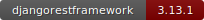
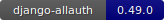

## 실행방법

- 아나콘다가 설치되어 있어야 합니다.

- 아나콘다의 가상환경 파이썬 버전을 3.9로 맞춰서 생성합니다.

- ```bash
  conda install django==3.2.5
  ```

  - 가상환경에 먼저 장고를 설치합니다.

- 프로젝트를 열고 아래 명령어를 입력하여 필요한 라이브러리를 설치합니다.
  - 프로젝트의 가상환경이 설정되어 있지 않다면 위에서 생성한 가상환경과 연결시켜주면 됩니다.

```bash
pip install -r requirements.txt
```

 이 과정들을 진행한 후 마이그레이션, 마리그레이트를 하여 db에 테이블을 생성하고 서버를 실행하거나 테스트를 진행합니다.

- 마이그레이션 : `python manage.py makemigrations`
- 마이그레이트 : `python manage.py migrate`
- 테스트 : `python manage.py test`
- 서버 실행 : `python manage.py runserver`
- 메시지 인증번호를 받으려면 API에 인증번호를 받을 전화번호를 입력하면 됩니다.
- db.sqlite3과 0001_initial.py(마이그레이션파일)은 삭제한 후 압축하였습니다. 

## 구현스펙

### [API 문서 보러가기](https://documenter.getpostman.com/view/14425036/UVyn2K6G)

다음과 같은 API를 포함하고 있습니다.

- 전화번호 인증
  - 문자메시지 인증번호 발송
  - 인증번호 확인
- 회원가입
- 로그인
  - 토큰 발급
  - 토큰 재발급
- 내 정보 조회
- 비밀번호 찾기(재설정)
  - 임시 비밀번호 설정
  - 비밀번호 재설정

## 사용기술

[](https://github.com/django/django/tree/stable/3.2.x)

[](https://www.python.org/downloads/release/python-390/)

[](https://django-rest-auth.readthedocs.io/en/latest/index.html)

[](https://www.django-rest-framework.org/)

[](https://django-allauth.readthedocs.io/en/latest/installation.html)


